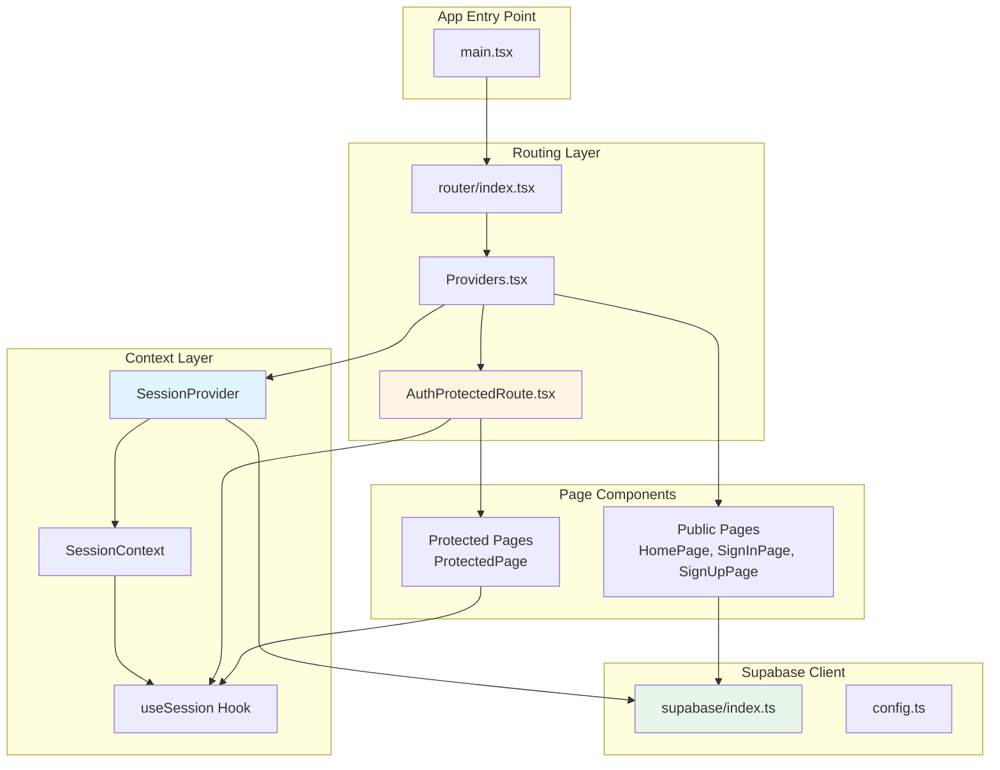
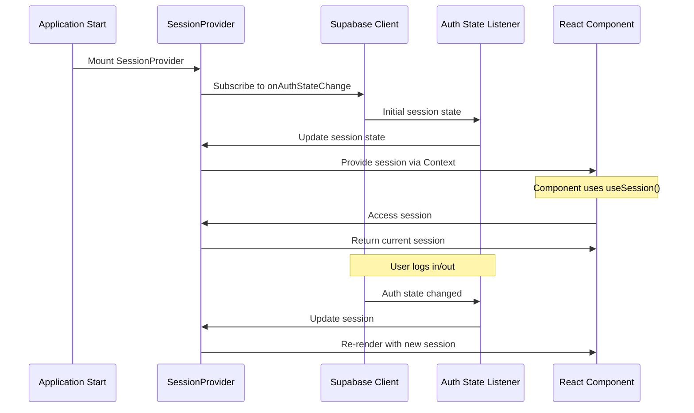
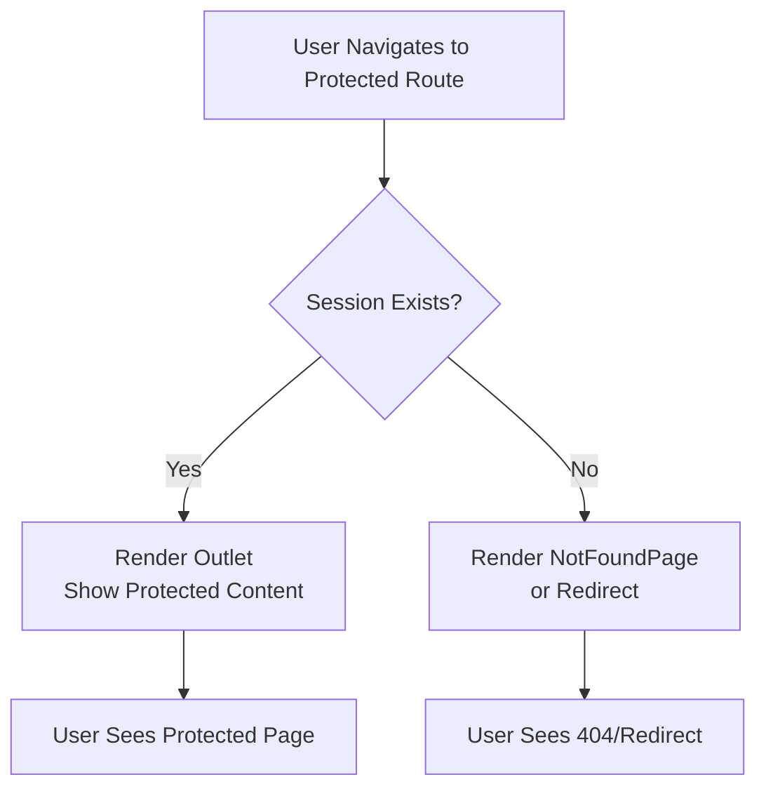
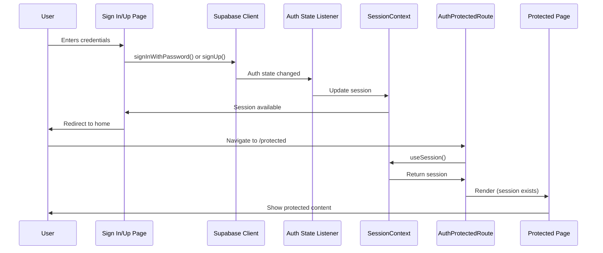
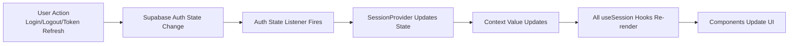

# Supabase Authentication Architecture Guide

This document provides a comprehensive overview of the React Supabase authentication architecture used in this template. Use this guide to understand the implementation and refactor existing messy Supabase auth setups to match this clean, maintainable pattern.

## Table of Contents

1. [Architecture Overview](#architecture-overview)
2. [Component Breakdown](#component-breakdown)
3. [Data Flow](#data-flow)
4. [Code Examples](#code-examples)
5. [Migration Guide](#migration-guide)
6. [Best Practices](#best-practices)
7. [File Structure](#file-structure)

---

## Architecture Overview

This template implements a clean, scalable authentication architecture using React Context API for global session management and React Router for protected routes. The architecture follows these key principles:

- **Single Source of Truth**: Session state is managed in one place (`SessionContext`)
- **Automatic Synchronization**: Session updates automatically via Supabase auth state listener
- **Component-Based Protection**: Routes are protected using wrapper components, not route-level guards
- **Type Safety**: Full TypeScript support with proper Supabase types

### Architecture Diagram



### Key Components

1. **SessionContext** - Global session state management
2. **AuthProtectedRoute** - Route guard component
3. **Providers** - Context provider wrapper
4. **Router Configuration** - Route definitions with protection
5. **Authentication Pages** - Sign in, sign up, and sign out logic

---

## Component Breakdown

### 1. Session Context & Global State Management

**File**: `src/context/SessionContext.tsx`

The `SessionContext` provides a centralized way to manage and access the Supabase session throughout the application.

#### Key Features:

- **React Context API**: Creates a context for session state
- **SessionProvider Component**: Wraps the app and manages session lifecycle
- **useSession Hook**: Custom hook for accessing session from any component
- **Automatic Synchronization**: Listens to Supabase auth state changes
- **Loading State**: Shows loading page while initial session is being fetched
- **TypeScript Support**: Properly typed with Supabase Session type

#### How It Works:

1. `SessionProvider` initializes with `session: null` and `isLoading: true`
2. On mount, it subscribes to `supabase.auth.onAuthStateChange`
3. When auth state changes (login, logout, token refresh), the session is updated
4. Components using `useSession` automatically re-render when session changes
5. During initial load, a `LoadingPage` is shown until the session is determined

#### Session State Flow:



---

### 2. Protected Routes & Route Guards

**File**: `src/router/AuthProtectedRoute.tsx`

The `AuthProtectedRoute` component acts as a guard for protected routes, ensuring only authenticated users can access them.

#### Key Features:

- **Component-Based Protection**: Uses React Router's `<Outlet />` pattern
- **Session Check**: Verifies authentication using `useSession` hook
- **Fallback Behavior**: Shows 404 page when unauthenticated (customizable)
- **Clean Separation**: Protection logic is separate from route definitions

#### How It Works:

1. Component uses `useSession()` to get current session
2. If no session exists, it returns `<NotFoundPage />` (or can redirect)
3. If session exists, it renders `<Outlet />` to display child routes
4. This pattern allows nested protected routes

#### Protection Flow:



---

### 3. Routing Configuration

**File**: `src/router/index.tsx`

The router configuration defines all application routes and their protection levels.

#### Key Features:

- **React Router v7**: Uses `createBrowserRouter` for modern routing
- **Nested Routes**: Hierarchical route structure
- **Provider Integration**: `Providers` component wraps all routes
- **Route Separation**: Clear distinction between public and protected routes
- **404 Handling**: Catch-all route for unmatched paths

#### Route Structure:

```
/ (Providers)
├── / (HomePage) - Public
├── /auth/sign-in (SignInPage) - Public
├── /auth/sign-up (SignUpPage) - Public
└── / (AuthProtectedRoute)
    └── /protected (ProtectedPage) - Protected
* (NotFoundPage) - Catch-all
```

#### Route Protection Pattern:

Protected routes are wrapped in an `AuthProtectedRoute` component, which acts as a parent route. All child routes under it are automatically protected.

---

### 4. Provider Setup

**File**: `src/Providers.tsx`

The `Providers` component serves as the root wrapper that initializes all context providers.

#### Key Features:

- **Single Entry Point**: One place to add all providers
- **SessionProvider Integration**: Wraps app with session context
- **Outlet Pattern**: Uses React Router's `<Outlet />` for nested routing
- **Clean Architecture**: Separates provider logic from routing

#### How It Works:

1. `Providers` wraps all routes in the router configuration
2. It renders `SessionProvider` which initializes the session context
3. Uses `<Outlet />` to render child routes
4. All child routes have access to the session context

---

### 5. Authentication Actions

#### Sign In

**File**: `src/pages/auth/SignInPage.tsx`

- Uses `supabase.auth.signInWithPassword(email, password)`
- But if Social Auth is being used use that, but have similar structure
- Handles form state and submission
- Shows loading status during authentication
- Auto-redirects if user is already logged in
- Displays error messages on failure

#### Sign Up

**File**: `src/pages/auth/SignUpPage.tsx`

- Uses `supabase.auth.signUp(email, password)`
- But if Social Auth is being used use that, but have similar structure
- Similar form handling as sign in
- Auto-redirects if user is already logged in
- Handles account creation errors

#### Sign Out

**File**: `src/pages/HomePage.tsx` (example)

- Uses `supabase.auth.signOut()`
- Can be called from any component
- Automatically updates session context via auth state listener
- No manual state management needed

#### Auto-Redirect Pattern

Both sign-in and sign-up pages check if a session already exists:

```typescript
const { session } = useSession();
if (session) return <Navigate to="/" />;
```

This prevents authenticated users from accessing auth pages.

---

### 6. Supabase Client Setup

**File**: `src/supabase/index.ts`

The Supabase client is initialized once and exported as a singleton.

#### Key Features:

- **Single Instance**: One Supabase client for the entire app
- **Environment Variables**: Configuration via `config.ts`
- **Default Export**: Easy to import anywhere
- **Type Safety**: Full TypeScript support

**File**: `src/config.ts`

- Validates required environment variables
- Exports `SUPABASE_URL` and `SUPABASE_ANON_KEY`
- Provides clear error messages if variables are missing

---

## Data Flow

### Authentication Flow



### Session Update Flow



---

## Code Examples

### SessionContext Implementation

```12:43:src/context/SessionContext.tsx
export const useSession = () => {
  const context = useContext(SessionContext);
  if (!context) {
    throw new Error("useSession must be used within a SessionProvider");
  }
  return context;
};

type Props = { children: React.ReactNode };
export const SessionProvider = ({ children }: Props) => {
  const [session, setSession] = useState<Session | null>(null);
  const [isLoading, setIsLoading] = useState(true);

  useEffect(() => {
    const authStateListener = supabase.auth.onAuthStateChange(
      async (_, session) => {
        setSession(session);
        setIsLoading(false);
      }
    );

    return () => {
      authStateListener.data.subscription.unsubscribe();
    };
  }, [supabase]);

  return (
    <SessionContext.Provider value={{ session }}>
      {isLoading ? <LoadingPage /> : children}
    </SessionContext.Provider>
  );
};
```

### Protected Route Implementation

```1:14:src/router/AuthProtectedRoute.tsx
import { Outlet } from "react-router-dom";
import NotFoundPage from "../pages/404Page";
import { useSession } from "../context/SessionContext";

const AuthProtectedRoute = () => {
  const { session } = useSession();
  if (!session) {
    // or you can redirect to a different page and show a message
    return <NotFoundPage />;
  }
  return <Outlet />;
};

export default AuthProtectedRoute;
```

### Router Configuration

```10:46:src/router/index.tsx
const router = createBrowserRouter([
  // I recommend you reflect the routes here in the pages folder
  {
    path: "/",
    element: <Providers />,
    children: [
      // Public routes
      {
        path: "/",
        element: <HomePage />,
      },
      {
        path: "/auth/sign-in",
        element: <SignInPage />,
      },
      {
        path: "/auth/sign-up",
        element: <SignUpPage />,
      },
      // Auth Protected routes
      {
        path: "/",
        element: <AuthProtectedRoute />,
        children: [
          {
            path: "/protected",
            element: <ProtectedPage />,
          },
        ],
      },
    ],
  },
  {
    path: "*",
    element: <NotFoundPage />,
  },
]);
```

### Using Session in Components

```1:17:src/pages/ProtectedPage.tsx
import { Link } from "react-router-dom";
import { useSession } from "../context/SessionContext";

const ProtectedPage = () => {
  const { session } = useSession();
  return (
    <main>
      <Link className="home-link" to="/">
        ◄ Home
      </Link>
      <section className="main-container">
        <h1 className="header-text">This is a Protected Page</h1>
        <p>Current User : {session?.user.email || "None"}</p>
      </section>
    </main>
  );
};
```

### Sign In Implementation

```25:36:src/pages/auth/SignInPage.tsx
  const handleSubmit = async (e: React.FormEvent<HTMLFormElement>) => {
    e.preventDefault();
    setStatus("Logging in...");
    const { error } = await supabase.auth.signInWithPassword({
      email: formValues.email,
      password: formValues.password,
    });
    if (error) {
      alert(error.message);
    }
    setStatus("");
  };
```

### Supabase Client Setup

```1:6:src/supabase/index.ts
import { createClient } from "@supabase/supabase-js";
import { SUPABASE_ANON_KEY, SUPABASE_URL } from "../config";

const supabase = createClient(SUPABASE_URL, SUPABASE_ANON_KEY);

export default supabase;
```

---

## Migration Guide

Use this step-by-step guide to refactor an existing messy Supabase auth setup to match this architecture.

### Step 1: Install Dependencies

Ensure you have the required packages:

```bash
npm install @supabase/supabase-js react-router-dom
# or
yarn add @supabase/supabase-js react-router-dom
```

### Step 2: Create Session Context

1. Create `src/context/SessionContext.tsx`
2. Copy the SessionContext implementation from the code examples
3. Ensure `LoadingPage` component exists (create if needed)

### Step 3: Create Provider Wrapper

1. Create `src/Providers.tsx`
2. Wrap your router with `SessionProvider`

### Step 4: Set Up Supabase Client

1. Create `src/supabase/index.ts`
2. Create `src/config.ts` for environment variables
3. Ensure `.env` file has `VITE_SUPABASE_URL` and `VITE_SUPABASE_ANON_KEY`

### Step 5: Create Protected Route Component

1. Create `src/router/AuthProtectedRoute.tsx`
2. Implement the route guard component

### Step 6: Update Router Configuration

1. Update your router to use `createBrowserRouter` (React Router v7)
2. Wrap routes with `Providers` component
3. Wrap protected routes with `AuthProtectedRoute`

Example migration:

**Before:**
```typescript
// Old messy approach
const PrivateRoute = ({ children }) => {
  const [session, setSession] = useState(null);
  const [loading, setLoading] = useState(true);
  
  useEffect(() => {
    supabase.auth.getSession().then(({ data }) => {
      setSession(data.session);
      setLoading(false);
    });
  }, []);
  
  if (loading) return <div>Loading...</div>;
  return session ? children : <Navigate to="/login" />;
};
```

**After:**
```typescript
// Clean approach using this architecture
const AuthProtectedRoute = () => {
  const { session } = useSession();
  if (!session) return <NotFoundPage />;
  return <Outlet />;
};
```

### Step 7: Update Authentication Pages

1. Remove manual session state management
2. Use `useSession()` hook instead
3. Add auto-redirect logic for already-authenticated users
4. Keep Supabase auth calls (`signInWithPassword`, `signUp`, `signOut`)

### Step 8: Update Components

1. Replace all manual session fetching with `useSession()` hook
2. Remove `useState` and `useEffect` for session management
3. Remove manual `getSession()` calls
4. Trust the context to provide up-to-date session

### Step 9: Clean Up

1. Remove duplicate session management code
2. Remove manual auth state listeners (now handled by SessionProvider)
3. Remove loading states for session (handled globally)
4. Consolidate session checks to use `useSession()`

### Migration Checklist

- [ ] SessionContext created and implemented
- [ ] SessionProvider wraps the app
- [ ] useSession hook available throughout app
- [ ] Supabase client configured in single file
- [ ] AuthProtectedRoute component created
- [ ] Router updated with protected route pattern
- [ ] All components use useSession() instead of manual session fetching
- [ ] Authentication pages updated
- [ ] Sign out functionality works
- [ ] Loading states handled globally
- [ ] TypeScript types properly configured
- [ ] Environment variables set up
- [ ] Old session management code removed

---

## Best Practices

### 1. Single Source of Truth

- **Do**: Use `useSession()` hook from SessionContext
- **Don't**: Create multiple session state instances or manually fetch sessions

### 2. Automatic State Management

- **Do**: Let `SessionProvider` handle all session updates via auth state listener
- **Don't**: Manually call `getSession()` or manage session state in components

### 3. Route Protection

- **Do**: Use `AuthProtectedRoute` component to wrap protected routes
- **Don't**: Check session in every protected component individually

### 4. Loading States

- **Do**: Let `SessionProvider` handle initial loading state
- **Don't**: Show loading spinners in every component that needs session

### 5. Type Safety

- **Do**: Use TypeScript and import types from `@supabase/supabase-js`
- **Don't**: Use `any` types or ignore TypeScript errors

### 6. Error Handling

- **Do**: Handle authentication errors at the page level
- **Don't**: Let errors bubble up without user feedback

### 7. Environment Variables

- **Do**: Use environment variables for Supabase configuration
- **Don't**: Hardcode API keys or URLs

### 8. Component Organization

- **Do**: Keep authentication logic in dedicated auth pages
- **Don't**: Mix authentication logic with business logic

---

## File Structure

```
src/
├── context/
│   └── SessionContext.tsx          # Session context and provider
├── router/
│   ├── index.tsx                    # Router configuration
│   └── AuthProtectedRoute.tsx       # Route guard component
├── supabase/
│   └── index.ts                     # Supabase client instance
├── pages/
│   ├── auth/
│   │   ├── SignInPage.tsx           # Sign in page
│   │   └── SignUpPage.tsx           # Sign up page
│   ├── HomePage.tsx                 # Public home page
│   ├── ProtectedPage.tsx            # Example protected page
│   ├── LoadingPage.tsx              # Loading state component
│   └── 404Page.tsx                  # Not found page
├── Providers.tsx                    # Root provider wrapper
├── config.ts                        # Environment variable config
└── main.tsx                         # App entry point
```

### File Responsibilities

- **SessionContext.tsx**: Global session state management
- **AuthProtectedRoute.tsx**: Route protection logic
- **router/index.tsx**: Route definitions and structure
- **Providers.tsx**: Context provider initialization
- **supabase/index.ts**: Supabase client configuration
- **config.ts**: Environment variable handling
- **pages/auth/**: Authentication UI and logic
- **pages/**: Application pages (public and protected)

---

## Troubleshooting

### Session Not Updating

**Problem**: Session doesn't update after login/logout

**Solution**: 
- Ensure `SessionProvider` wraps your entire app
- Check that `onAuthStateChange` listener is properly subscribed
- Verify Supabase client is the same instance everywhere

### Protected Routes Not Working

**Problem**: Users can access protected routes without authentication

**Solution**:
- Verify `AuthProtectedRoute` wraps protected routes in router config
- Check that `useSession()` is being called correctly
- Ensure session is properly initialized in `SessionProvider`

### Infinite Loading

**Problem**: App shows loading screen indefinitely

**Solution**:
- Check Supabase client configuration
- Verify environment variables are set correctly
- Check browser console for errors
- Ensure `onAuthStateChange` callback is firing

### TypeScript Errors

**Problem**: Type errors with Session type

**Solution**:
- Import `Session` type from `@supabase/supabase-js`
- Ensure `@supabase/supabase-js` is installed
- Check TypeScript configuration

---

## Summary

This architecture provides:

✅ **Centralized Session Management** - One place for session state  
✅ **Automatic Synchronization** - Session updates automatically  
✅ **Type Safety** - Full TypeScript support  
✅ **Clean Route Protection** - Component-based guards  
✅ **Scalable Structure** - Easy to extend and maintain  
✅ **Best Practices** - Follows React and Supabase patterns  

Use this guide to refactor your existing Supabase authentication setup and achieve a clean, maintainable architecture.
